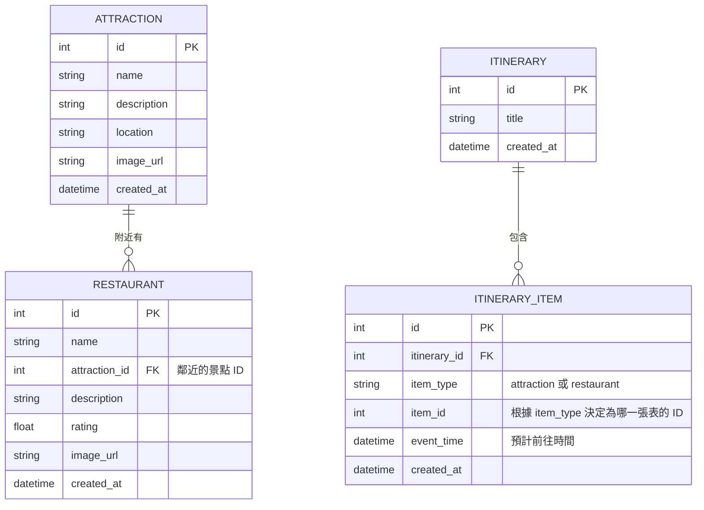

# 旅遊系統 - 資料庫設計文件 (DB DESIGN)

這份文件根據 PRD 與 FLOWCHART 的設計，定義了系統專用的 SQLite 資料庫 Schema 及關聯。考量到 MVP 首波的重點在於「資訊查詢」與「建立行程清單」，本次設計暫未納入會員體系（使用者皆以單機或 Cookie 模擬身份），未來若擴編會員登入模組即可輕易嫁接。

## 1. ER 圖（實體關係圖）

## 2. 資料表詳細說明

### ATTRACTION (景點表)
儲存旅遊地區中值得參訪的景點資訊。
- `id` (INTEGER, PK): 唯一識別碼，自增。
- `name` (TEXT, 必填): 景點名稱。
- `description` (TEXT): 景點詳細介紹。
- `location` (TEXT, 必填): 地理位置關鍵字或是座標（供天氣 API 查詢使用）。
- `image_url` (TEXT): 圖片連結。
- `created_at` (DATETIME): 資料建立時間。

### RESTAURANT (餐廳表)
儲存景點周邊的餐廳或美食資訊。
- `id` (INTEGER, PK): 唯一識別碼，自增。
- `name` (TEXT, 必填): 餐廳名稱。
- `attraction_id` (INTEGER, FK): 關聯至特定的 ATTRACTION，代表此餐廳位於哪個景點附近。
- `description` (TEXT): 餐廳特色與介紹。
- `rating` (REAL): 餐廳評分 (例如 4.5)。
- `image_url` (TEXT): 圖片連結。
- `created_at` (DATETIME): 資料建立時間。

### ITINERARY (行程總表)
儲存使用者的行程專案紀錄。
- `id` (INTEGER, PK): 唯一識別碼，自增。
- `title` (TEXT, 必填): 行程名稱 (例如: "週末台北三日遊")。
- `created_at` (DATETIME): 資料建立時間。

### ITINERARY_ITEM (行程項目表)
儲存行程中每個時間點要去的景點或餐廳（採用多型設計存放）。
- `id` (INTEGER, PK): 唯一識別碼，自增。
- `itinerary_id` (INTEGER, FK, 必填): 關聯至 ITINERARY。
- `item_type` (TEXT, 必填): 項目類型（"attraction" 或 "restaurant"）。
- `item_id` (INTEGER, 必填): 對應 ATTRACTION.id 或 RESTAURANT.id。
- `event_time` (DATETIME, 必填): 預計前往的時間。
- `created_at` (DATETIME): 資料建立時間。

## 3. SQL 建表語法與 Model 程式碼
* 對應的 SQL 檔案請見：`database/schema.sql` 
* Python 模型放置於：`app/models` 資料夾中
