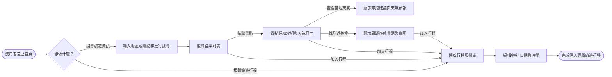
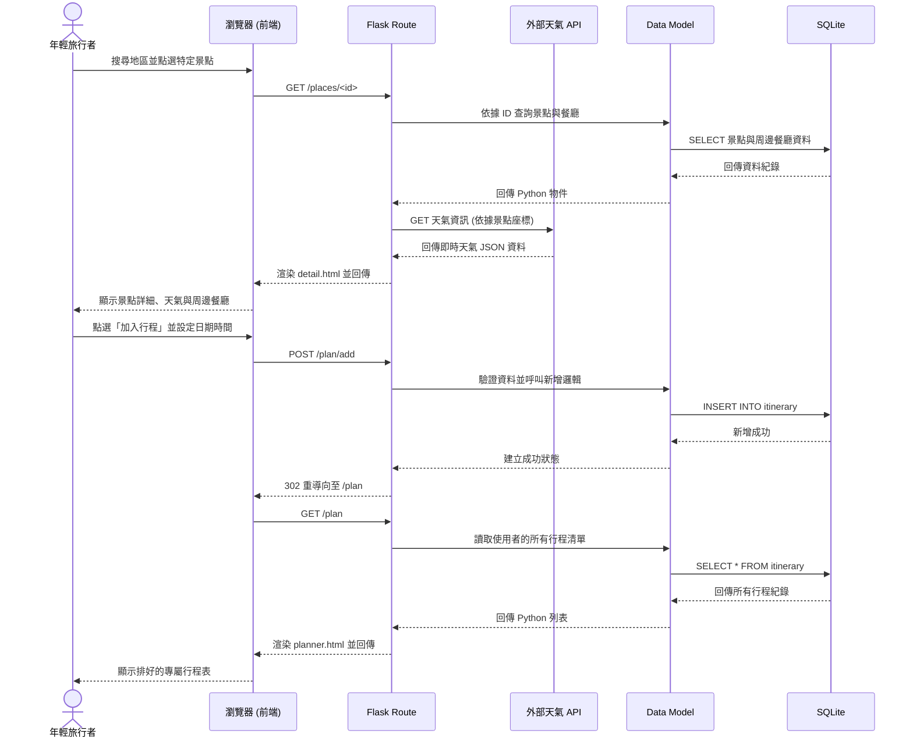

# 旅遊系統 - 流程圖文件 (FLOWCHART)

這份文件基於 `docs/PRD.md` 的功能需求與 `docs/ARCHITECTURE.md` 的系統架構，描述了使用者的操作流程與系統內部的運作機制。

## 1. 使用者流程圖 (User Flow)

此流程圖展示了年輕旅行者進入旅遊平台後，主要能夠進行的操作路徑，包含搜尋、檢視景點與天氣、搜尋周邊餐廳，到最後的行程規劃。

## 2. 系統序列圖 (Sequence Diagram)

此圖以「使用者透過搜尋功能查看景點並規劃行程」為例，展示前端瀏覽器、Flask 後端、外部天氣 API 與 SQLite 資料庫之間的互動順序。

## 3. 功能清單對照表

以下為統整出的主要功能、對應的獨立 URL 路徑與 HTTP 方法的介面規劃總表：

| 主要功能 | 說明 | HTTP 方法 | URL 路徑 (暫定) |
| --- | --- | --- | --- |
| **首頁** | 顯示系統進入畫面與搜尋框 | GET | `/` |
| **搜尋功能** | 處理搜尋關鍵字，回傳符合的結果列表 | GET | `/search` |
| **景點查詢與天氣** | 顯示單一景點的完整介紹與動態天氣 | GET | `/places/<id>` |
| **查詢吃飯的地方** | 顯示景點周邊的推薦餐廳清單 | GET | `/places/<id>/restaurants` |
| **查看行程表** | 顯示使用者已規劃好的行程列表 | GET | `/plan` |
| **新增/規劃行程** | 將景點或餐廳寫入使用者的行程規劃內 | POST | `/plan/add` |
| **編輯/刪除行程** | 變更時間或從規劃清單中移除特定項目 | POST | `/plan/update_or_delete` |
